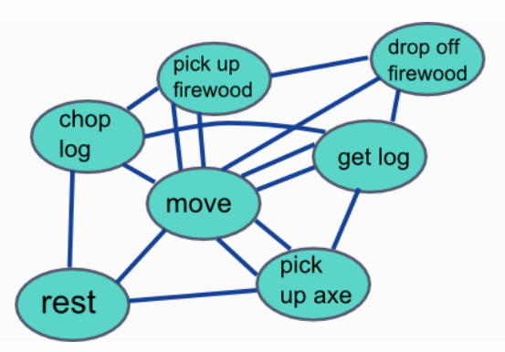

# Goal Oriented Action Planning (GOAP)
Goal Oriented Action Planning is a type of disicion making for AI. Other examples are a Finite State Machine (FSM) or Behaviour Tree. But which one is best? They all have pros and cons. 

### What is GOAP?
GOAP is similar to a Finite State Machine (if you do not know this, I recommend reading a little about this first). They both define a number of states or actions. In a FSM you add conditions to connect every state as you can see in *picture 1*. But the biggest disadvantage is that adding a new state requires a lot of work to define every possible transition to other states. It is also difficult to make an overview to keep track of your state machine. 

*Picture 1: representation of a Finite State Machine [^1]*

If your state machine becomes too complex, you might consider GOAP. Here you only define the actions (see *picture 2*) and a goal. Instead of defining conditions to change between actions, you assign every action (optional) preconditions and effects. Depending on the goal, the world state and the available actions, your AI will create an action plan at runtime. The advantage is of course that it requires less work to define the actions, but by creating a plan at runtime, you have less control over your AI's behaviour.

*Picture 2: representation of a Goal Oriented Action Planning [^1]*

### Actions
So what exactly is an action? First of all, an action is a single step that changes something and does NOT know anything about other actions. Besides the action itself, you need to define an effect, which is what changes after the action is done. For every action you can (optionally) define one or more preconditions. These are required states before you can do this action. Preconditions can be procedural, meaning they need some world information to know if something can be done. Using the example from the pictures above: before you can use 'pick up axe', you will need to check if there is an axe present in the world and where it is. Furthermore, every action should have a cost. Actions with a higher cost will be avoided if possible. This can also be procedural. In the axe example: how far away is the axe? 

### Making a plan
As I mentioned before, the GOAP strategy defines a plan at runtime. Therefor you need a Planner, which needs to know the current state of the AI and the world and the goal of the AI. The planner will build up a tree of all possible sequences of actions, as you can see in *picture 3*. This example starts at the beginning, asking 'Can I run this action in the current state?'. If the answer is yes, then update the 'current' state and go over the actions again. Note that this is only the plan, so the actions still need to be executed. Second, the Planner will not stop when it found one possible action. It will keep searching to create the whole tree and (remember we gave actions a cost) at the end, it will calculate the total cost of a sequence and determine the best option. 

I think it should also be possible to start from the end instead, asking 'Which action could fulfill my goal?' and then continue with 'Which action could fulfill the preconditions that I need?', but I have not (yet) found an example working this way.

*Picture 3: making a tree of possible action sequences [^1]*

### Executing a plan
Now that we have our Actions and a Planner... How do we execute our plan? This is most often done in combination with a very simple FSM, namely with 3 states: Idle, MoveTo and DoAction. While in the Idle state, your AI will find their goal, current situation and call the Planner to make a plan, usually in a queue of actions. Then it will start with checking the first action. Every action should know if it must be done at a specific location or can be executed wherever you are. If it has a location, change state to MoveTo and set the target, else continue with DoAction and repeat with the next action. When all actions are done (or something important changes) return to state Idle and make a new plan.

# My Project
I will try this AI in the framework that we used in class. It is a simple Agario game, with a bunch of agents wandering and one smarter AI agent. For this smart agent we made two versions, one using FSM and one using a binary tree structure. Now I will make a third version with Goap and summarize the advantages and disadvantages in my experience.

First of all, I built in the simple FSM in one class because I know on forehand that the states and conditions will never change. It is only the base to switch between making a plan, executing an action and moving. Since agario does not have complex sequences of actions, the plan is only to chose the one most valuable action at that time. Every agent also has a blackboard with information about himself and the world that the behavior needs to know. I store the available actions there too.

[^1]: Source: https://gamedevelopment.tutsplus.com/tutorials/goal-oriented-action-planning-for-a-smarter-ai--cms-20793
