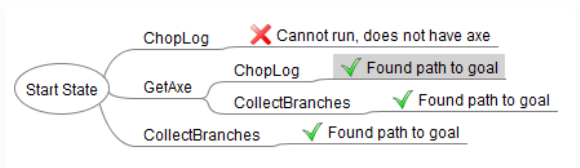

# Goal Oriented Action Planning (GOAP)
Goal Oriented Action Planning is a type of disicion making for AI. Other examples are a Finite State Machine (FSM) or Behaviour Tree. But which one is best? They all have pros and cons. 

### What is GOAP?
GOAP is similar to a Finite State Machine (if you do not know this, I recommend reading about this first). They both define a number of states or actions. In a FSM you add conditions to connect every state as you can see in *picture 1*. But the biggest disadvantage is that adding a new state requires a lot of work to define every possible transition to other states. It is also difficult to make an overview to keep track of your state machine. 

*Picture 1: representation of a Finite State Machine [^1]*

If your state machine becomes too complex, you might consider GOAP. Here you only define the actions (see *picture 2*) and a goal. Instead of defining conditions to change between actions, you assign every action (optional) preconditions and effects. Depending on the goal, the world state and the available actions, your AI will create an action plan at runtime. The advantage is of course that it requires less work to define the actions, but by creating a plan at runtime, you have less control over your AI's behaviour.

*Picture 2: representation of a Goal Oriented Action Planning [^1]*

### Actions
So what exactly is an action? First of all, an action is a single step that changes something and does not know anything about other actions. Besides the action itself, you can define an effect, which is the change it makes after the action is done. For every action you can (optionally) define one or more preconditions. These are required states before you can do this action. Preconditions can be procedural, meaning they need some world information to know if something can be done. Using the example from the pictures above: before you can use 'pick up axe', you will need to check if there is an axe present in the world and where it is. Furthermore, every action should have a cost or value. If different plans are available, the AI will chose the easiest or most valuable plan. This can also be procedural. In the axe example: how far away is the axe? Whether to use cost or value is a choice you can make depending on your game. (e.g. if the goal is score points, you can use value instead)

### Making a plan
As I mentioned before, the GOAP strategy defines a plan at runtime. Therefor you need a Planner, which needs to know the current state of the AI and the world and the goal of the AI. The planner will build up a tree of all possible sequences of actions, as you can see in *picture 3*. This example starts at the beginning, asking 'Can I run this action in the current state?'. If the answer is yes, then update the 'current' state and go over the actions again. Note that this is only the plan, so the actions still need to be executed. Second, the Planner will not stop when it found one possible action. It will keep searching to create the whole tree and (remember we gave actions a cost/value) at the end, it will calculate the total cost/value of a sequence and determine the best option. 

I think it should also be possible to start from the end instead, asking 'Which action could fulfill my goal?' and then continue with 'Which action could fulfill the preconditions that I need?', but I have not (yet) found an example working this way.

*Picture 3: making a tree of possible action sequences [^1]*

### Executing a plan
Now that we have our Actions and a Planner... How do we execute our plan? This is most often done in combination with a very simple FSM, namely with 3 states: Idle, MoveTo and DoAction. While in the Idle state, your AI will find their goal, current situation and call the Planner to make a plan, usually in a queue of actions. Then it will start with checking the first action. Every action should know if it must be done at a specific location or can be executed wherever you are. If it has a location, change state to MoveTo and set the target, else continue with DoAction and repeat with the next action. When all actions are done (or something important changes) return to state Idle and make a new plan.

# My Project
I will try this AI in the framework that we used in class. It is a simple Agario game, with a bunch of agents wandering and one smarter AI agent. For this smart agent we made two versions, one using FSM and one using a binary tree structure. Now I will make a third version with GOAP and summarize the advantages and disadvantages in my experience.

First of all, I built in the simple FSM in one class because I know on forehand that the states and conditions will never change. It is only the base to switch between making a plan, executing an action and moving. Since agario does not have complex sequences of actions and the environment changes quickly, the plan is only to chose the one most valuable action at that time and then check the environment again for the next action. I also added a timer to force my agent to look around and make a new plan every few seconds. Besides that, I check every Update() if there is a bigger enemy close, and if so, change the plan. (The value of running from bigger and nearby enemies will always be bigger than any other action, since dead equals Game Over.

### So is GOAP better? 
In most cases it is at least more efficient: make a plan and stick to the plan. (Compared to e.g. a binary tree, where you go over the tree every frame.) Of course, the faster the world state changes, the more often you need to make a new plan and thus the more efficiency you lose. But as it is a disadvantage for fast-paced games, it may prove more valuable for strategy or turn-based games. After the initial setup of the GOAP objects, it also is very easy to add actions, literally only adding the action. Yes, you still need to think about their cost/value, effects and preconditions, but that is much less work compared to the FSM, where you need to think about every possible transition to every action that you already had. The more actions, the more difficult to draw an overview of your state machine. 

The biggest disadvantage to GOAP is debugging. You have very few control over the behavior of your AI and when something goes wrong, you will need a lot of time to find in which case or where in your code the bug exactly happens. But if your behavior is too complex, you might encounter bugs with a FSM where you forgot to add a transition.

So the choice is really up to you. Which type of desicion making you could use best depends on the type of the game and on what you just prefer to work with. I have not yet decided which one I prefer. I loved the ease of adding actions, but I feel like maybe Agario was not the perfect game to test GOAP since, as I mentioned before, there are not really sequences of actions. You just need the one best action for right now.

Another interesting option is to take a bit of both. (As I read here [^3]) For example a basic FSM, where each state contains a set of actions for GOAP. This way, you have the advantage to easyly interrupt the plan if something in the world happens. (e.g. A state of exploring the world, a state of attacking, a state of doing something else. And each state with their own actions.)

### Sources
You can find the source of the pictures I used below (nr 1). Here is another article with a differnt example [^2]. And in my opinion a very interesting one [^3], which also suggests an optimization of the planner with A* search, if you can place actions in the form of a graph using their effects and preconditions as connections.

[^1]: Source: https://gamedevelopment.tutsplus.com/tutorials/goal-oriented-action-planning-for-a-smarter-ai--cms-20793
[^2]: https://medium.com/@vedantchaudhari/goal-oriented-action-planning-34035ed40d0b
[^3]: https://jaredemitchell.com/goal-oriented-action-planning-research/
